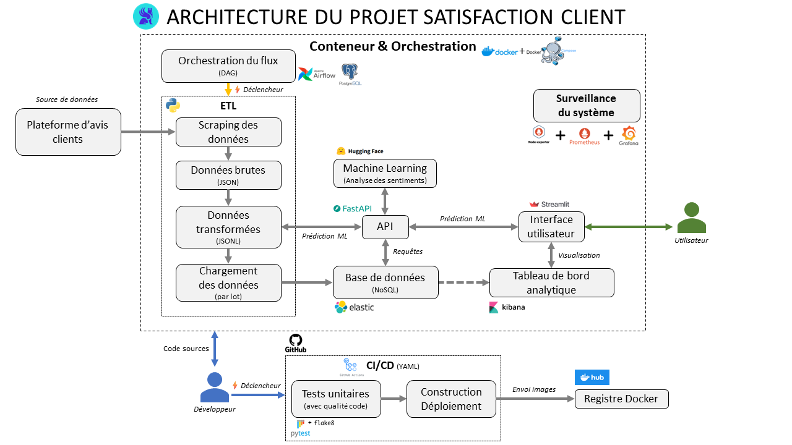
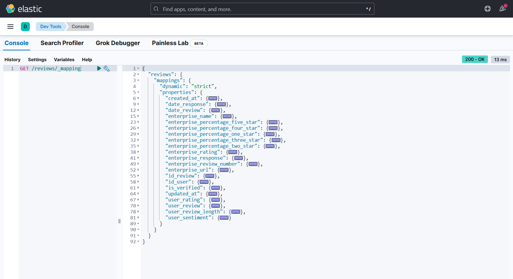
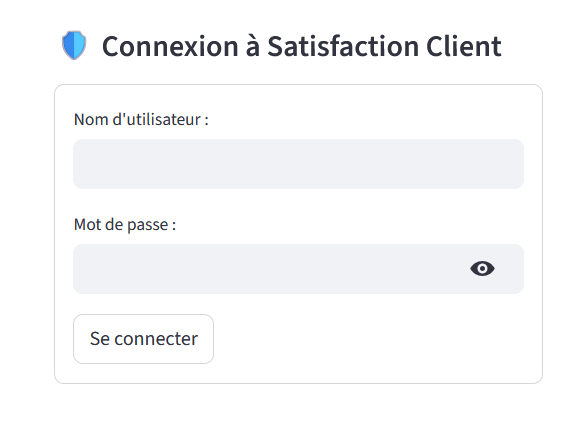
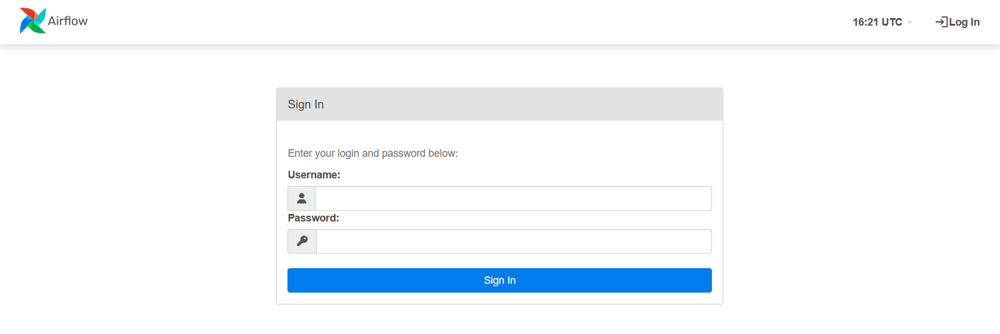
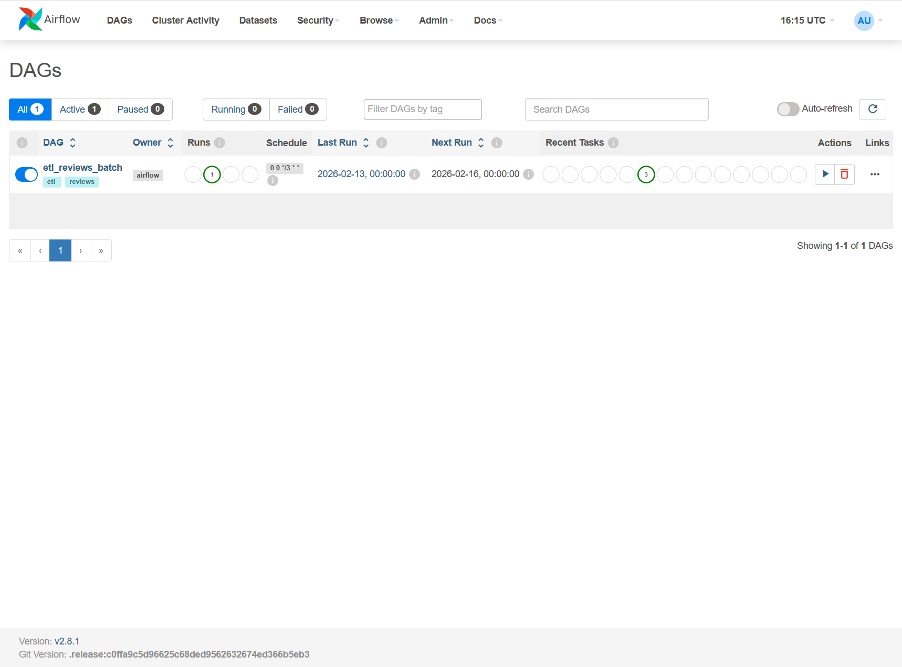
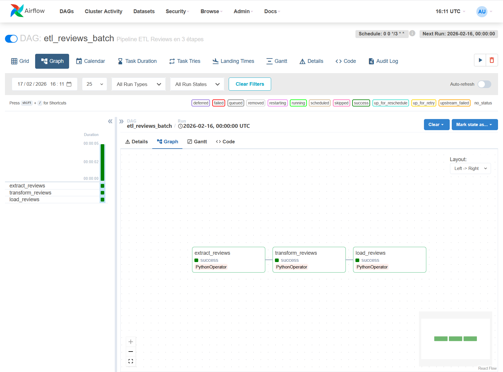
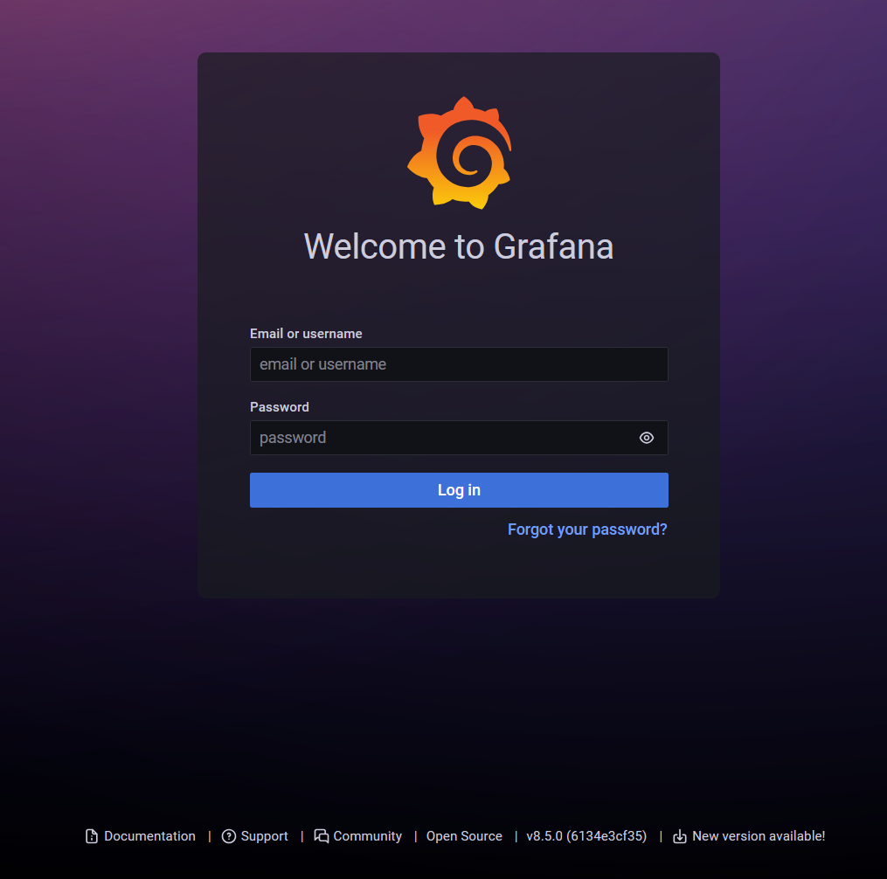
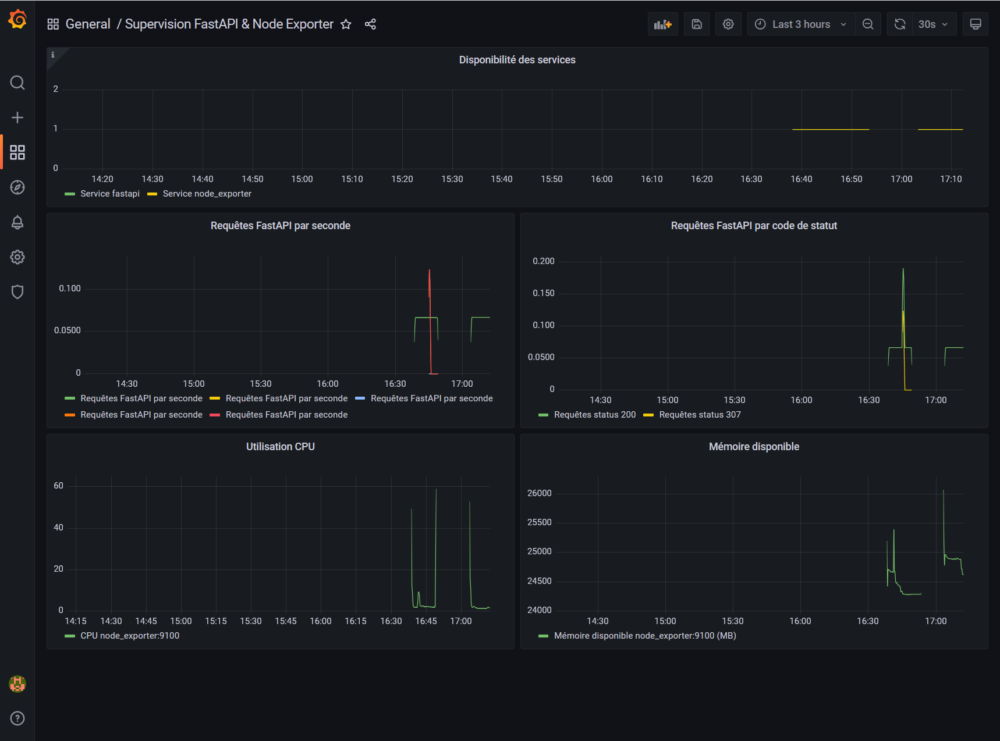
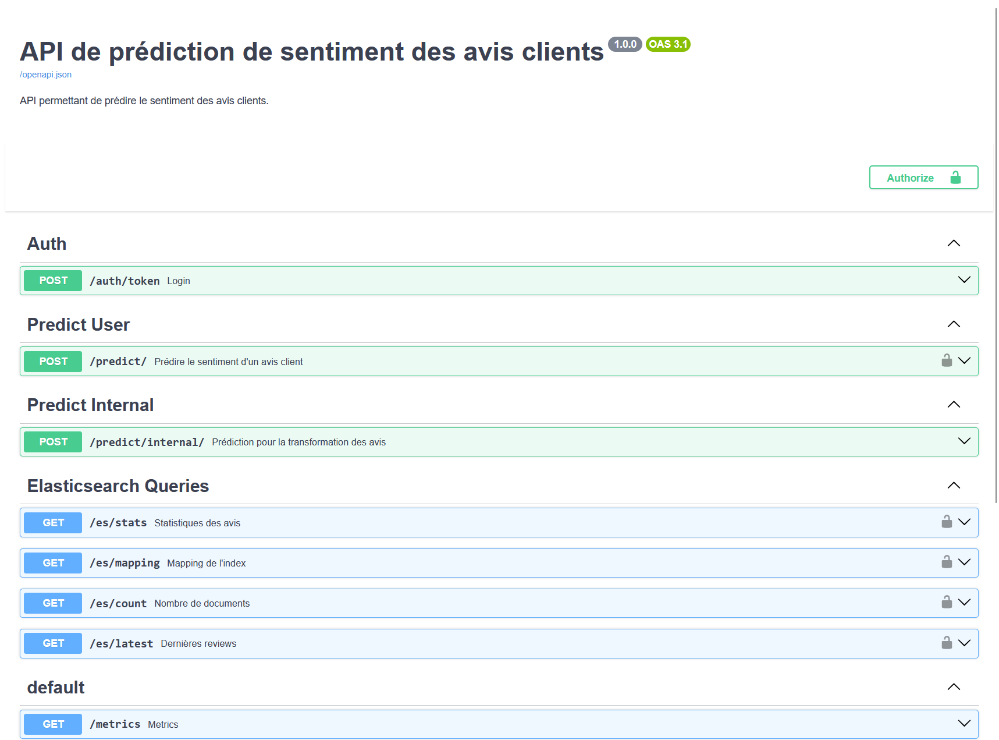

# NOV25 – Plateforme d’analyse de la satisfaction client

## 🚀 Présentation

Cette plateforme permet d’automatiser l’analyse de la satisfaction client à partir d’avis en ligne, depuis la collecte des données brutes jusqu’à leur exploitation via une API et des tableaux de bord interactifs.

Le projet met en œuvre une **chaîne Data Engineering complète**, conçue pour être **scalable, observable et automatisée**, couvrant l’ensemble du cycle de vie des données : ingestion, transformation, enrichissement, stockage, exposition et supervision.

Il a été réalisé dans le cadre du **Bootcamp Data Engineer – DataScientest**, en adoptant une approche proche d’un contexte professionnel (pipeline orchestré, conteneurisation, CI/CD, monitoring).

---

## 🎯 Contexte & cas d’usage (simulé)

Une entreprise souhaite centraliser et analyser automatiquement les avis clients publiés en ligne afin de :

- suivre l’évolution de la satisfaction client dans le temps,
- identifier rapidement les points de friction ou d’insatisfaction,
- fournir des indicateurs exploitables aux équipes métier et produit,
- disposer d’une solution automatisée et supervisée, limitant les traitements manuels.

La solution proposée automatise l’ensemble du flux de données, depuis la collecte des avis jusqu’à leur visualisation et leur exposition via des API.

---

## 🎯 Objectifs du projet

- Collecter automatiquement des avis clients à grande échelle
- Nettoyer, standardiser et anonymiser les données (conformité RGPD)
- Enrichir les avis par une analyse de sentiment (NLP)
- Stocker et indexer les données dans une base NoSQL orientée recherche
- Exposer les données via une API REST documentée
- Mettre à disposition des dashboards interactifs pour l’analyse
- Orchestrer, monitorer et déployer l’ensemble du pipeline de manière fiable

---

## 🔄 Pipeline ETL – De la collecte à l’indexation

### Extraction (EXTRACT)

- Collecte automatisée des avis clients via un processus de scraping
- Gestion de la pagination et validation des données
- Export des données au format **JSON brut**, conservant l’ensemble des informations originales

### Transformation (TRANSFORM)

- Nettoyage et standardisation des données textuelles
- Anonymisation des informations sensibles
- Analyse de sentiment pour classifier les avis (positif, négatif, neutre)
- Enregistrement des données transformées au format **JSONL**, adapté au traitement de volumes importants

### Chargement (LOAD)

- Chargement des données dans une base **NoSQL (Elasticsearch)**
- Utilisation d’un mécanisme d’**upsert** afin de garantir une base cohérente et à jour
- Journalisation détaillée et gestion des erreurs pour le suivi du pipeline

Ce pipeline permet de transformer des avis clients bruts en **données structurées, enrichies et exploitables**.

---

## ⏱️ Orchestration & automatisation

Le pipeline ETL est orchestré à l’aide d’**Apache Airflow**, qui organise les différentes étapes sous forme de **DAG (Directed Acyclic Graph)**.

Les principaux bénéfices :

- Vision globale du pipeline et de l’enchaînement des tâches
- Suivi précis des statuts (success, running, failed)
- Accès détaillé aux logs pour le diagnostic des erreurs
- Possibilité de déclencher, suspendre ou relancer le pipeline manuellement
- Planification automatique des traitements selon un calendrier défini

---

## 📊 Accès aux données & visualisation

Les résultats sont accessibles via :

- une **API REST FastAPI**, permettant l’exposition des données et des résultats d’analyse,
- des **dashboards Kibana**, intégrés directement dans l’interface **Streamlit** via iframe.

Cette intégration offre :

- un point d’accès unique pour l’ensemble des indicateurs,
- une navigation simple et fluide pour les utilisateurs,
- une visualisation interactive facilitant l’exploration des avis et des sentiments associés.

Ces outils permettent aux équipes **business** et **produit** d’identifier rapidement les leviers d’amélioration et de prioriser les actions.

---

## 📈 Supervision & observabilité

La plateforme intègre une couche de monitoring pour suivre le pipeline ETL et l’état du système :

- **Airflow** pour l’orchestration des workflows, permettant de visualiser le statut des tâches et la date de dernière exécution
- **Prometheus** pour la collecte de métriques applicatives et système
- **Grafana** pour la visualisation de ces métriques (tableaux de bord prêts à personnaliser selon les besoins)
- **Node Exporter** pour l’accès aux métriques système

> Les indicateurs réellement suivis dans le projet incluent le statut des workflows ETL et la date de dernière exécution.  
> Grafana et Prometheus permettent de préparer facilement la supervision des ressources et de la disponibilité en production.


---

## 🏗️ Architecture globale du projet



🔄 Pipeline ETL – Avis clients → Elasticsearch

Ce dépôt contient un pipeline ETL (Extract – Transform – Load) permettant de collecter des avis clients et de les indexer dans Elasticsearch (indice `reviews`).

🔹 Extraction

- Collecte des avis pour une ou plusieurs entreprises (une entreprise dans ce projet)
- Gestion automatique de la pagination
- Validation et filtrage initial des données

🔹 Transformation

- Anonymisation des données sensibles (conformité RGPD)
- Nettoyage et normalisation des textes
- Parsing et standardisation des dates
- Enrichissement et structuration des documents pour Elasticsearch

🔹 Chargement

- Indexation via opérations bulk pour de meilleures performances
- Mécanisme d’upsert pour éviter les doublons
- Logs détaillés et gestion des erreurs pour le suivi du pipeline

🐳 Environnement Docker & Services

L’ensemble du projet est déployé via Docker Compose, garantissant la portabilité et l’isolation des services.

| Service          | Rôle                                                        |
|------------------|-------------------------------------------------------------|
| **Airflow**      | Orchestration et planification des DAGs ETL                 |
| **FastAPI**      | API REST pour l’accès aux données et résultats d’analyse    |
| **Streamlit**    | Interface utilisateur et dashboards interactifs             |
| **Elasticsearch**| Stockage, recherche et agrégation des avis                  |
| **Kibana**       | Exploration et visualisation des données Elasticsearch      |
| **Prometheus**   | Collecte des métriques applicatives                         |
| **Grafana**      | Monitoring et dashboards de supervision                     |
| **Node Exporter**| Collecte des métriques système                              |

🧰 Stack technique

- Langage : Python
- Data Engineering : Airflow, ETL, Elasticsearch
- Machine Learning / NLP : Analyse de sentiment
- Backend : FastAPI
- Frontend : Streamlit
- Conteneurisation : Docker, Docker Compose
- Observabilité : Prometheus, Grafana

👥 Équipe projet

ibbouM  
roxfr Thierry M  
SofianeDore

---

## Table des matières

1. [Prérequis](#1-prérequis)
2. [Configuration et exécution locale](#2-configuration-et-exécution-locale)
3. [Tests Unitaires](#3-tests-unitaires)
4. [Exécution avec Docker Compose](#4-exécution-avec-docker-compose)
5. [Création d’une vue et d’un tableau de bord dans ES/Kibana](#5-création-dune-vue-et-dun-tableau-de-bord-dans-es-kibana)
6. [Accès à Streamlit](#6-accès-à-streamlit)
7. [Accès à Apache Airflow](#7-accès-à-apache-airflow)
8. [Accès à Prometheus/Grafana](#8-accès-à-prometheus-grafana)
9. [Accès à FastAPI (docs)](#9-accès-à-fastapi-docs)
10. [Dépannage & problèmes fréquents](#10-dépannage--problèmes-fréquents)

---

## 1. Prérequis

| Outil          | Version | Obligatoire |
| -------------- | ------- | ----------- |
| Python         | 3.10+   | ✅         |
| Docker         | 20.x+   | ✅         |
| Docker Compose | 2.20+   | ✅         |
| Elasticsearch  | 8.12    | optionnel  |
| Kibana         | 8.12    | optionnel  |
|**WSL Ubuntu**  | 2.6+    | ✅         |

---

## 2. Configuration et exécution locale

### 2.1. Création de l’environnement virtuel

   ```bash
   # Sous WSL Ubuntu depuis la racine du projet
   python3 -m venv venv
   source venv/bin/activate
   pip install --upgrade pip
   pip install -r requirements.txt
   ```

---

## 3. Tests Unitaires

Les tests du projet sont réalisés avec pytest.</br>
Pour exécuter tous les tests, il suffit de se rendre à la racine du projet et</br>
de lancer la commande suivante :

   ```bash
   # Sous WSL Ubuntu depuis la racine du projet
   source venv/bin/activate
   export PYTHONPATH=$(pwd)/src
   echo $PYTHONPATH
   pytest src/tests
   ```

---

## 4. Exécution avec Docker Compose

⚠️ **Attention** :</br>
   - Les commandes ci-dessous suppriment tous les conteneurs, images et volumes Docker liés au stack, et réinitialise toutes les données persistantes.
Utilisez-la uniquement si vous voulez repartir complètement à zéro ou pour votre première exécution du stack.

   - Si ce script est modifié sous Windows (VS Code),
exécuter `dos2unix start_stack.sh` avant de lancer le script

   ```bash
   cd src/docker
   docker volume prune -f
   docker image prune -a -f
   docker network prune -f
   docker container prune -f
   docker system prune -a -f --volumes
   docker-compose down --volumes --rmi all --remove-orphans
   docker buildx prune -a -f
   ```

   ```bash
   # Docker Desktop doit être démarré
   # Depuis la racine du projet

   # WSL Ubuntu (terminal)
   cd src/docker
   chmod +x start_stack.sh
   ./start_stack.sh

   # Windows (PowerShell admin)
   cd src\docker
   Set-ExecutionPolicy -Scope Process -ExecutionPolicy Bypass
   .\start_stack.ps1
   ```

---

## 5. Création d’une vue et d’un tableau de bord dans ES/Kibana

### 5.1. Accès à ES/Kibana

   ```bash
   http://localhost:5601
   ```

### 5.2. Vérification des données

Depuis ES/Kibana – Dev Tools :

   ```bash
   # Liste tous les indices
   GET /_cat/indices?v
   # Voir le mapping d'un index
   GET /reviews/_mapping
   # Compter le nombre de documents
   GET /reviews/_count
   # Récupére tous les documents
   GET /reviews/_search
   {
      "query": {
         "match_all": {}
      }
   }
   # Récupére les 3 dernières reviews les plus récents
   GET reviews/_search
   {
      "size": 3,
      "sort": [
         { "id_review": { "order": "desc" } }
      ]
   }
   ```



### 5.3. Création d’une Data View

   ```bash
   Nom : NOV25_BDE_SATISFACTION_CLIENT
   Index pattern : reviews*
   Champ temporel : Aucun
   ```

### 5.4. Visualisation

1. Accéder à Elastic/Kibana depuis le navigateur : http://localhost:5601/app/home#/

2. Aller dans **Visualize Library** → **Create new visualization**

3. Sélectionner le type de visualisation : **Lens**

4. Choisir la **Data View** précédemment créée (`NOV25_BDE_SATISFACTION_CLIENT`)

5. Créer les visualisations suivantes :

   - **Histogramme des notes** (répartition des avis par score)
   - **Top catégories** (catégories les plus représentées)
   - **Volume d’avis** (nombre total d’avis ou évolution)

6. Enregistrer chaque visualisation pour pouvoir les réutiliser dans un tableau de bord.

---

## 6. Accès à Streamlit

   ```bash
   http://localhost:8501
   ```

   - Identifiant  : admin</br>
   - Mot de passe : admin



---

## 7. Accès à Apache Airflow

   ```bash
   http://localhost:8081/login/
   ```

   - Identifiant  : admin</br>
   - Mot de passe : admin





---

## 8. Accès à Prometheus/Grafana

- Prometheus :

   ```bash
   http://localhost:9090/targets
   ```

- Grafana :

   ```bash
   http://localhost:3000
   ```

   - Identifiant  : admin</br>
   - Mot de passe : admin




---

## 9. Accès à FastAPI (docs)

- Prometheus :

   ```bash
   http://localhost:8000/docs
   ```



---

## 10. Dépannage & problèmes fréquents

| Problème                  | Cause probable                   | Solution                                               |
| ------------------------- | -------------------------------- | ----------------------------------------------------- |
| ES ne démarre pas          | Port 9200 utilisé, mémoire faible | Vérifier ports et ajuster `docker-compose.yml`       |
| ConnectionError ES         | Service ES pas encore prêt       | Attendre 30s ou ajouter un retry                     |
| Mapping non appliqué       | Indice existant                  | Supprimer l’indice : `DELETE /reviews`              |
| Data View introuvable      | Mauvais pattern                  | Vérifier que le pattern est `reviews*`              |
| Problème de permissions    | Volume Docker                    | `chmod -R 777 ./data`                                |
| Docker sous Windows        | Docker Desktop ou WSL2 inactif   | Vérifier Docker Desktop et WSL2, puis relancer      |
| Invalid char '/' config.json | `~/.docker/config.json` invalide | Supprimer tout commentaire et garder `{ "auths": {} }` |
| WSL + Docker login échoue  | Credential helper mal configuré | Supprimer entrées invalides, garder `{ "auths": {} }`, refaire `docker login` |
